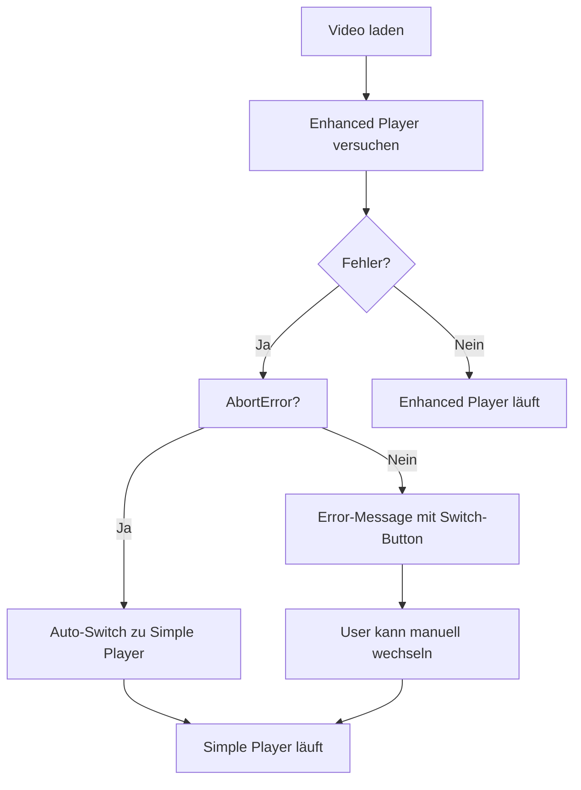

# 🎬 Video-Player Debug Guide

## 🚨 Häufige Probleme und Lösungen

### Problem: "AbortError - play() interrupted by pause()"

**Ursache:**
- ReactPlayer versucht gleichzeitig zu spielen und zu pausieren
- Race Condition zwischen User-Interaktionen
- Browser-Sicherheitsrichtlinien für Autoplay

**Lösungen implementiert:**

#### 1. **Enhanced Video Player** (ReactPlayer-basiert)
```typescript
// Bessere Event-Behandlung
const handlePlay = () => {
  console.log('Video play triggered')
  setPlaying(true)
  setShowControls(true)
  setError(null)
}

// Verzögertes Seeking
setTimeout(() => {
  if (startTime > 0 || progress.currentTime > 0) {
    const seekTime = startTime || progress.currentTime
    playerRef.current?.seekTo(seekTime)
  }
}, 500)
```

#### 2. **Simple Video Player** (HTML5-basiert)
```typescript
// Promise-basierte Play-Behandlung
const playPromise = videoRef.current.play()
if (playPromise !== undefined) {
  playPromise
    .then(() => setPlaying(true))
    .catch((error) => {
      console.error('Play failed:', error)
      setError('Wiedergabe fehlgeschlagen.')
    })
}
```

#### 3. **Automatischer Fallback**
- Bei AbortError automatisch auf Simple Player wechseln
- User kann manuell zwischen Playern wechseln
- Debug-Info zeigt aktiven Player an

---

## 🔧 Player-Vergleich

| Feature | Enhanced Player | Simple Player |
|---------|----------------|---------------|
| **Technologie** | ReactPlayer | HTML5 Video |
| **Kompatibilität** | Hoch | Sehr hoch |
| **Features** | Vollständig | Basis |
| **Bookmarks** | ✅ | ❌ |
| **Geschwindigkeit** | ✅ | ❌ |
| **Vollbild** | ✅ | ❌ |
| **Stabilität** | Mittel | Hoch |
| **Fehlerbehandlung** | Komplex | Einfach |

---

## 🐛 Debugging

### Console Logs aktiviert:
```javascript
// Enhanced Player
console.log('Video play triggered')
console.log('Video pause triggered')
console.log('Video ready')
console.log('Seeking to:', seekTime)

// Simple Player
console.error('Play failed:', error)
```

### Debug-Info im UI:
```typescript
<div className="mb-2 text-xs text-gray-500">
  Player: {useSimplePlayer ? 'HTML5 (Simple)' : 'ReactPlayer (Enhanced)'}
</div>
```

---

## 🚀 Testing Checklist

### Browser-Tests:
- [ ] Chrome (Desktop/Mobile)
- [ ] Firefox (Desktop/Mobile)
- [ ] Safari (Desktop/Mobile)
- [ ] Edge (Desktop)

### Video-Format-Tests:
- [ ] MP4 (H.264)
- [ ] WebM
- [ ] MOV
- [ ] Verschiedene Auflösungen

### Funktions-Tests:
- [ ] Play/Pause
- [ ] Seeking
- [ ] Volume
- [ ] Fullscreen
- [ ] Progress-Speicherung
- [ ] Auto-Resume
- [ ] Bookmarks (Enhanced only)

---

## 🔄 Fallback-Logik



---

## ⚙️ Konfiguration

### Für Entwicklung (mehr Debugging):
```typescript
// src/lib/config.ts
export const videoPlayerConfig = {
  debug: true,
  autoFallback: true,
  preferSimplePlayer: false,
  logErrors: true
}
```

### Für Produktion (weniger Logs):
```typescript
export const videoPlayerConfig = {
  debug: false,
  autoFallback: true,
  preferSimplePlayer: false,
  logErrors: false
}
```

---

## 📊 Error-Tracking

### Häufige Fehler:
1. **AbortError**: Play unterbrochen → Auto-Fallback
2. **NotAllowedError**: Autoplay blockiert → User-Interaktion erforderlich
3. **NotSupportedError**: Format nicht unterstützt → Fallback-Format
4. **NetworkError**: Verbindungsproblem → Retry-Mechanismus

### Lösungsstrategien:
- **Graceful Degradation**: Funktionalität reduzieren statt Crash
- **User-Feedback**: Klare Fehlermeldungen mit Lösungsvorschlägen
- **Automatic Recovery**: Wo möglich, automatisch beheben
- **Manual Override**: User kann Entscheidungen treffen

---

## 🎯 Nächste Verbesserungen

### Geplant:
- [ ] Adaptive Bitrate für verschiedene Verbindungen
- [ ] Vorschau-Thumbnails auf Progress Bar
- [ ] Kapitel-Navigation
- [ ] Untertitel-Support
- [ ] Offline-Download (PWA)

### Experimentell:
- [ ] WebRTC für Live-Streams
- [ ] VR/360°-Video Support
- [ ] AI-basierte Qualitätsanpassung

---

## 🛠️ Entwickler-Tools

### Quick-Switch für Tests:
```javascript
// In Browser Console:
// Zu Simple Player wechseln
window.switchToSimplePlayer = () => {
  // Implementation in Component
}

// Debug-Modus aktivieren
window.enableVideoDebug = () => {
  localStorage.setItem('videoDebug', 'true')
  location.reload()
}
```

**Aktueller Status: Beide Player implementiert mit automatischem Fallback!** ✅
